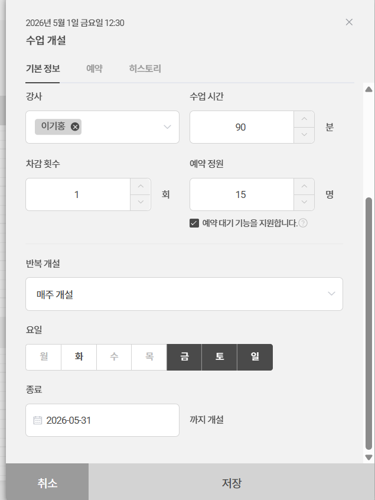
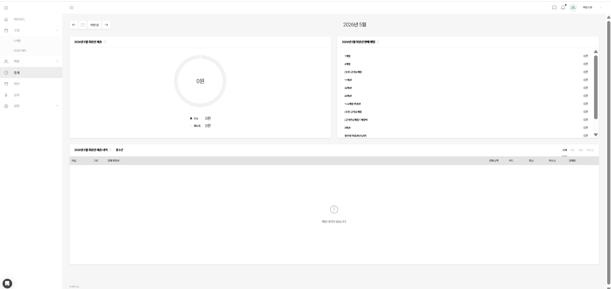
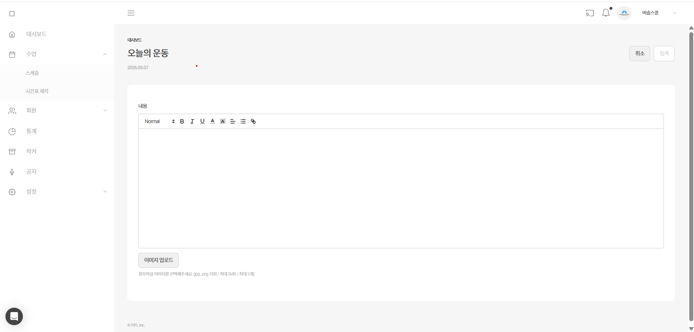
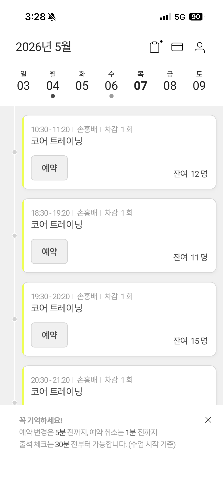
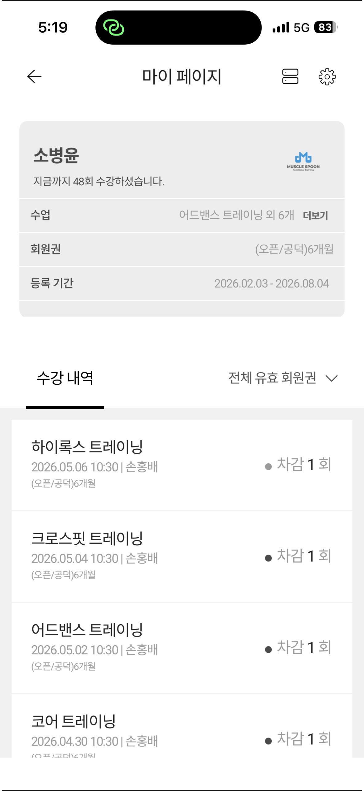

# 💪 MuscleSpoon — 헬스장 통합 관리 SaaS

> 헬스장 운영에 필요한 회원 관리, 수업 스케줄, PT, 락커, 통계까지  
> **관리자 웹 + 회원 앱**을 하나의 플랫폼으로 제공하는 풀스택 SaaS 프로젝트

<br>

## 🖥️ 화면 미리보기

| 관리자 — 수업 스케줄 | 관리자 — 수업 개설 |
|---|---|
|  |  |

| 관리자 — 통계 | 관리자 — 오늘의 운동 |
|---|---|
|  |  |

| 회원 — 수업 예약 | 회원 — 마이페이지 |
|---|---|
|  |  |

<br>

## ⚙️ 기술 스택

### Backend


### Frontend


### Infrastructure


<br>

## 🏗️ 아키텍처

```text
┌─────────────────────────────────────────────────────┐
│                    Client Layer                      │
│  관리자 웹 (Next.js 16)  │  회원 앱 (Next.js + PWA)  │
└──────────────┬──────────────────────┬───────────────┘
               │  REST API / JWT       │  WebSocket
               ▼                       ▼
┌─────────────────────────────────────────────────────┐
│              Spring Boot 3.5 (Java 17)              │
│  AuthController  BookingController  ChatController   │
│  MemberController  GymController  ...               │
│                                                     │
│              Spring Security 6 (JWT)                │
└──────────────────────┬──────────────────────────────┘
                       │
          ┌────────────┴────────────┐
          ▼                         ▼
    MySQL 8.0 (JPA)          Firebase FCM
    (멀티테넌트: gym_id)      (푸시 알림)
```

### 멀티테넌트 설계
- 단일 DB + `gym_id` 컬럼으로 헬스장별 데이터 격리
- 모든 쿼리에 `gym_id` 필터 적용 → 향후 다중 헬스장 온보딩 대응

<br>

## 🚀 주요 기능

### 관리자 페이지

| 기능 | 설명 |
|------|------|
| **대시보드** | 오늘의 수업 현황, 실시간 예약/취소 활동 피드 |
| **수업 스케줄** | 주간 뷰 수업 관리, 원클릭 수업 개설/삭제, 오늘의 운동 게시 |
| **회원 관리** | 회원 등록/수정, 회원권 등록, 이용 통계 |
| **PT 관리** | PT 일정 등록, 수업 일지 작성 |
| **락커 관리** | 락커 배정/반납, 만료 알림 |
| **통계** | 월별 매출, 회원 증감, 수업 참여율 차트 |
| **공지사항** | 회원 공지 작성 및 푸시 알림 발송 |
| **채팅** | 회원 ↔ 관리자 실시간 채팅 (WebSocket) |
| **설정** | 강사 관리, 수업/회원권/부가상품 템플릿, 운영 정책 설정 |
| **플랫폼 (슈퍼관리자)** | 전체 헬스장(테넌트) 생성/계약 관리, 플랫폼 공지 메시지 |

### 회원 앱 (PWA)

| 기능 | 설명 |
|------|------|
| **수업 예약** | 주간 스케줄 확인 및 예약/취소 |
| **오늘의 운동** | 관리자가 작성한 당일 운동 메뉴 확인 |
| **마이페이지** | 남은 회원권 횟수, 예약 내역, 프로필 수정 |
| **푸시 알림** | 수업 개설/변경, 공지사항 실시간 알림 (FCM) |

<br>

## 🔐 인증 및 보안

- **JWT Access Token** + **Refresh Token** 이중 토큰 구조
- **TokenVersion** 필드로 강제 로그아웃 구현 (비밀번호 변경, 관리자 차단 시 기존 토큰 무효화)
- **역할 기반 접근 제어 (RBAC)**: `SUPER_ADMIN` / `STAFF` / `MEMBER`
- 수업 예약 취소 시 소유권 검증 (JWT 이메일 ↔ 예약 회원 이메일 비교)

<br>

## 📊 핵심 구현 포인트

### 1. 실시간 활동 피드 (대시보드)
당일 수업에 한해 회원별 최신 예약 상태를 중복 제거하여 표시. 동일 회원이 취소 후 재예약한 경우 `CHANGED` 라벨로 병합 처리.

```java
// 회원별 최신 예약 1건만 추출 (중복 제거)
Map<Long, Booking> latestByMember = bookings.stream()
    .collect(Collectors.toMap(
        b -> b.getMember().getMemberId(),
        b -> b,
        (a, b) -> a.getCreatedAt().isAfter(b.getCreatedAt()) ? a : b
    ));
```

### 2. 회원권 예약 차감 시스템
수업 예약 시 잔여 횟수 확인 → 예약 확정 시 차감 → 취소 시 복구. 동시 예약 방지를 위한 트랜잭션 처리.

### 3. 오늘의 운동 (리치 텍스트)
관리자가 HTML 에디터로 운동 메뉴 작성 → 회원 앱에서 `DOMPurify` 산화 후 렌더링.

### 4. 커스텀 DatePicker / WeekPicker
라이브러리 없이 직접 구현한 날짜 선택 컴포넌트. 월 뷰 / 주 뷰 전환, 계약 기간 선택 등 다양한 컨텍스트에 재사용.

<br>

## 📁 프로젝트 구조

```
muscle-spoon/
├── gym-api/          # Spring Boot 백엔드
│   └── src/main/java/com/musclespoon/gymapi/
│       ├── controller/   # REST API 엔드포인트
│       ├── service/      # 비즈니스 로직
│       ├── entity/       # JPA 엔티티
│       ├── repository/   # Spring Data JPA
│       ├── security/     # JWT 필터, SecurityConfig
│       └── dto/          # 요청/응답 DTO
│
└── gym-web/          # Next.js 프론트엔드
    └── app/
        ├── (admin)/      # 관리자 페이지 (dashboard, lessons, members ...)
        ├── member/       # 회원 앱
        ├── super-admin/  # 플랫폼 관리
        └── login/        # 로그인 (관리자 / 회원 분리)
```

<br>

## 📅 개발 기간

2025.01 ~ 진행 중 (1인 풀스택 개발)
